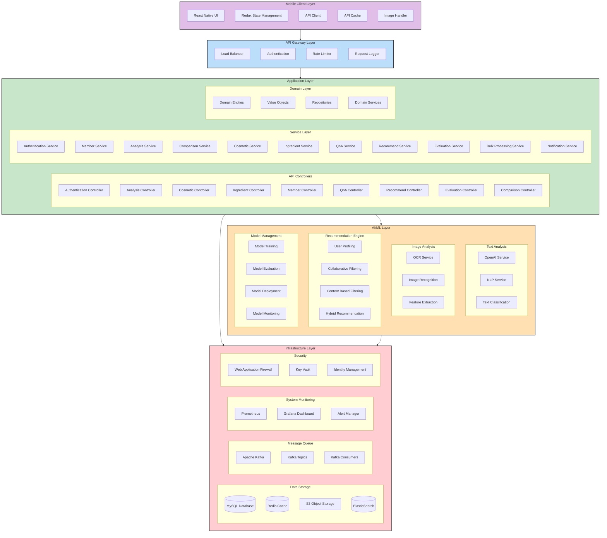
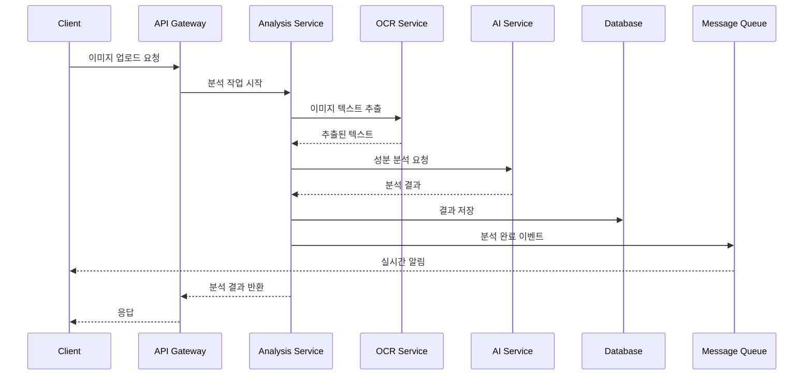
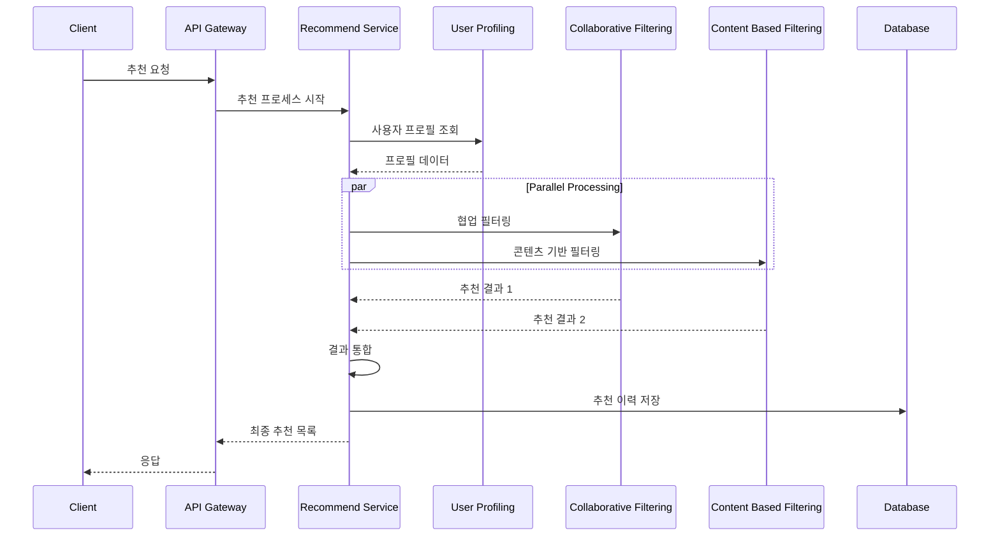
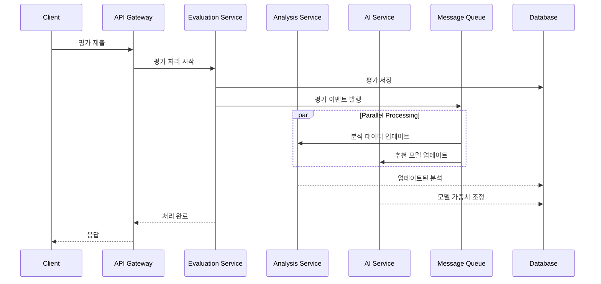
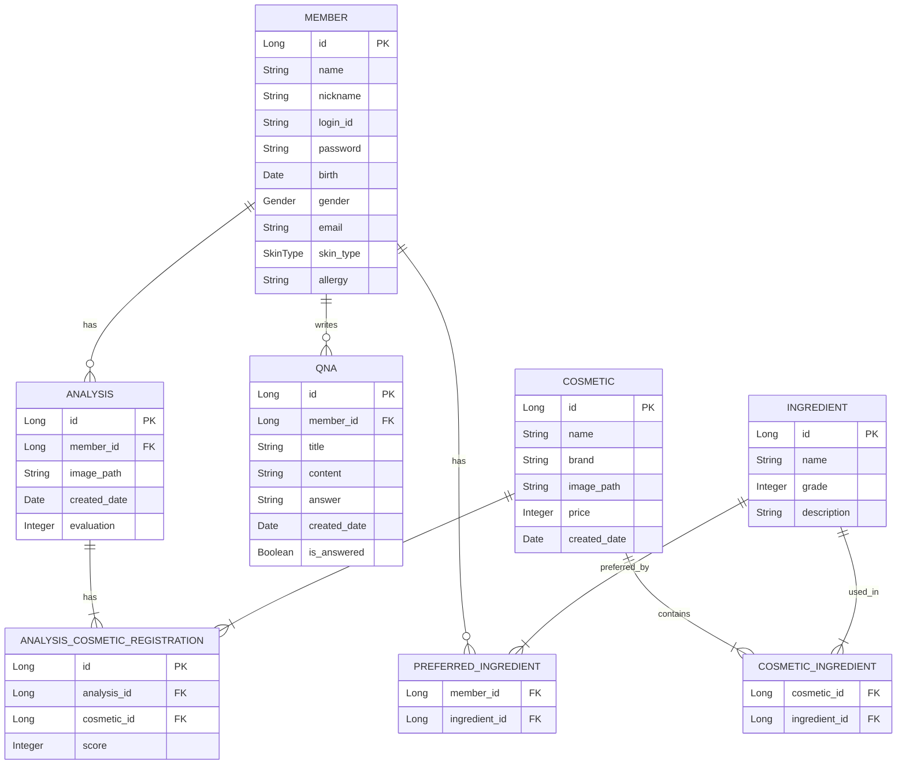
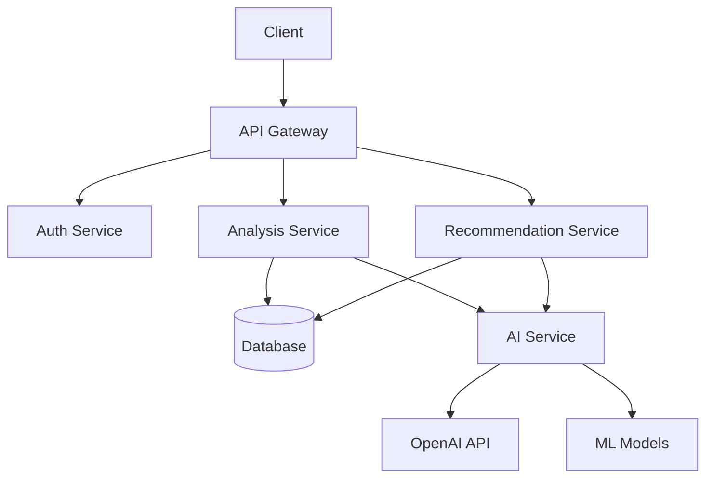
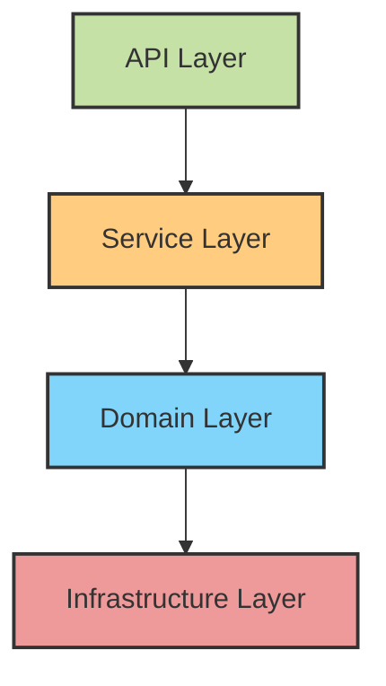
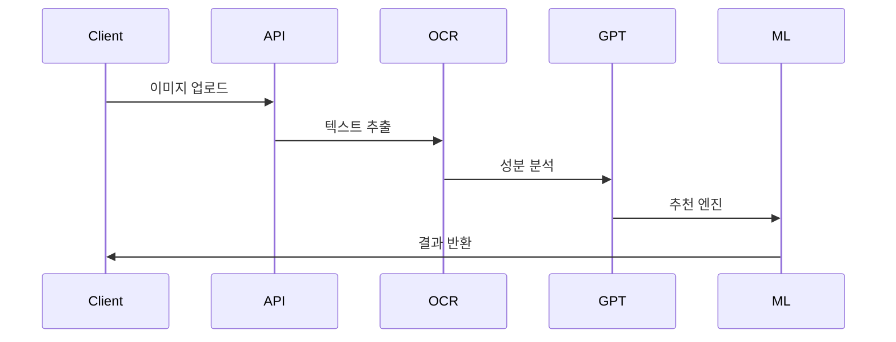
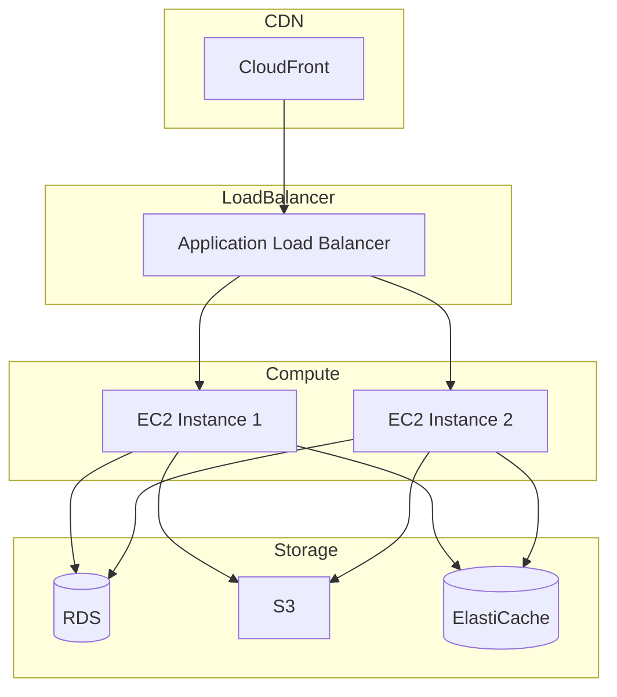
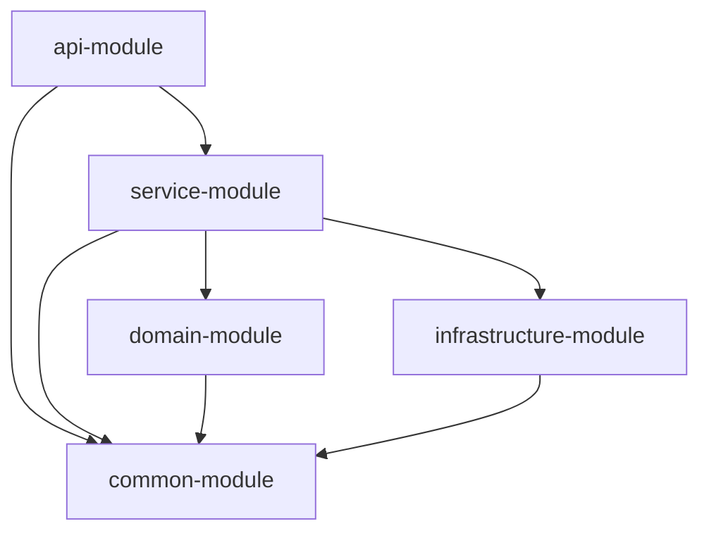

<div align="center"> 


### </> 이유를 찾고 이유를 만들어가는 개발자 </>

<br/>

## 🙋‍♂️ About me

"문제를 해결하는 데브워크 주니어, 저는 개발의 경계를 넓힙니다."

개발자는 단순한 기술자가 아니라 문제 해결사입니다. 저는 개발을 단순한 '스킬'이 아닌, 비즈니스, 서비스와 소통하며 퍼포먼스를 내는 '데브워크(DevWork)'라고 생각합니다. 개발, 구현력뿐만 아니라 회사를 이해하고, 효과적으로 소통하며, 올바른 방향을 선택하고 책임감을 가져야 한다고 생각합니다.

### 🔥 퍼포먼스를 내는 개발자 
개발 스킬뿐만 아니라 상대방이 원하는 것을 잘 이해하고 파악하여 정해진 시간, 정해진 퀄리티 안으로 구현해나가는 것, 필요하면 배워서라도 해가는, 단순히 할 수 있는 것과 되는 것이 아닌 할 수 있도록 만드는 개발자가 되고자 합니다.

### 🤝 우리의 힘
저는 개인의 역량보다 함께할 때 발휘되는 힘과 시너지가 비교할 수 없을 만큼 크다고 생각합니다.
프로젝트 경험에서 저는 항상 '나'보다는 '우리'를 우선시하며, '내가 어떻게 성장할까'보다는 '우리가 어떻게 하면 더 나은 결과와 최고의 결과를 만들어낼 수 있을까'를 끊임없이 고민하고 노력해왔습니다.

### 🧘 건강의 중요성을 깨달은 개발자
한때는 밤낮없이 개발하며 퍼포먼스를 내는 것만이 전부라고 생각했습니다.
하지만 건강을 잃고 나서야, 개발자는 꾸준히, 지속적으로 성장해야 하는 직업임을 깨달았습니다.
이를 위해서는 균형 잡힌 삶과 지속 가능한 개발이 필수적이라는 것을 몸소 체험하며 깊이 깨달았습니다.
그 후, 지속 가능한 성장을 위해 건강을 최우선으로 돌보며, 현재는 누구보다 건강을 중요시하는 개발자로 살아가고 있습니다.

<br/>

## 📞 Contact & Channel
- **Phone**: 010-2651-9025
- **Email**: gustn9025@naver.com
- **Github**: [github.com/IMCODER0000](https://github.com/IMCODER0000)
- **Portfolio**: [Notion Portfolio](https://www.notion.so/Back-End-Developer-16ca23f0db9b80d2b63cc965e546aa2b)

<br/>

## 🛠 Skills

### Languages


### Framework / Library


### Database


### Infrastructure


<br/>

## 💻 Projects

### IntellyCosm (2024.03 ~ 2024.06, 리팩토링: 2025.02 ~ 현재)
화장품 성분 분석 및 AI 기반 개인화 추천 플랫폼

**주요 기술:**
- Spring Boot, JPA, Spring Security
- AWS, Docker
- MySQL, Redis
- React (Admin)

**주요 성과:**
- 쿼리 최적화로 DB 조회 시간 40% 단축
- 커넥션 풀 최적화로 동시 처리 성능 200% 향상
- 화장품 데이터 처리 성능 70.1% 개선 (278ms → 83ms)
- 캐싱 레이어 도입으로 응답 시간 40% 감소

### TTP(Time To Play) [개인 프로젝트] (2024.01 ~ 현재)
실시간 웹소켓 기반 멀티플레이어 게임 플랫폼

**주요 기술:**
- Spring Boot (WebSocket)
- React
- Node.js
- Redis

**주요 성과:**
- WebSocket 기반 실시간 게임 서비스 구현
- 평균 응답 지연시간 50ms 이하 달성
- 시스템 안정성 85% 향상
- CPU 사용률 29% 감소

### Festival (2023.11 ~ 2024.12, 리팩토링: 2025.02 ~ 현재)
축제 정보 제공 및 소셜 플랫폼

**주요 기술:**
- Node.js, Express
- Spring Boot (마이그레이션)
- React, Flutter
- AWS (S3, Lambda)

**주요 성과:**
- AWS 리소스 최적화로 CPU 사용률 40~50% 감소
- 메모리 사용률 30~35% 절감
- 복합 인덱스 활용으로 쿼리 실행 시간 40% 개선
- 동시접속자 처리량 200% 향상

### TTP(Time To Play) [개인 프로젝트] (2024.01 ~ 현재)
실시간 웹소켓 기반 멀티플레이어 게임 플랫폼

**주요 기술:**
- Spring Boot (WebSocket)
- React
- Node.js
- Redis

**주요 성과:**
- WebSocket 기반 실시간 게임 서비스 구현
- 평균 응답 지연시간 50ms 이하 달성
- 시스템 안정성 85% 향상
- CPU 사용률 29% 감소

<div align="center">

&fontSize=70&animation=fadeIn&fontAlignY=35&desc=Play%20Together,%20Anytime,%20Anywhere&descAlignY=51&descAlign=50)

### 🎮 함께 즐기는 실시간 멀티플레이 게임 플랫폼

[](https://spring.io/projects/spring-boot)
[](https://reactjs.org/)
[](https://nodejs.org/)
[](https://redis.io/)
[](https://www.mysql.com/)
[](https://aws.amazon.com/)
[](https://www.docker.com/)

</div>

## 📖 프로젝트 소개

TTP(Time To Play)는 웹소켓 기반의 실시간 멀티플레이 게임 플랫폼입니다. PC, 모바일, 태블릿 등 다양한 디바이스에서 친구들과 함께 즐길 수 있는 게임 서비스를 제공합니다.

### 💝 프로젝트의 시작

이 프로젝트는 특별한 의미를 가지고 시작되었습니다. 3년간 병원에 입원 중인 한 어린 친구와의 만남이 계기가 되었습니다. "친구들과 함께 놀고 싶다"는 그 친구의 소망을 듣고, 거리와 상황에 상관없이 누구나 함께 즐길 수 있는 플랫폼을 만들기로 결심했습니다.

### 🎯 주요 기능

- **라이어 게임**: 거짓말쟁이를 찾아내는 추리 게임
- **스피드 퀴즈**: 친구들과 함께 즐기는 빠른 답변 게임
- **심리 테스트**: 재미있는 심리 테스트로 서로를 알아가기
- **실시간 채팅**: 게임 중 실시간 소통 가능

## 🛠 기술 스택

### Backend
- **Spring Boot**: 메인 게임 서버
- **Node.js & Express**: 보조 게임 서버
- **WebSocket & STOMP**: 실시간 양방향 통신
- **JPA**: 데이터 영속성 관리
- **Spring Security**: 보안 관리

### Frontend
- **React**: 웹 클라이언트
- **WebSocket**: 실시간 통신
- **Styled-components**: 스타일링

### Database & Cache
- **MySQL**: 주 데이터베이스
- **Redis**: 세션 및 실시간 데이터 관리
- **Caffeine**: 로컬 캐시

### Infrastructure
- **AWS EC2**: 서버 호스팅
- **AWS RDS**: 데이터베이스 관리
- **CloudFront**: CDN 서비스
- **Docker**: 컨테이너화
- **Nginx**: 웹 서버 및 로드 밸런싱

## 🏗 시스템 아키텍처

### 전체 시스템 구조


### 컴포넌트 상세 설명

#### 1. Mobile Client Layer
- **React Native UI**
  - 사용자 인터페이스 컴포넌트
  - 반응형 디자인
  - 네이티브 기능 통합
- **Redux State Management**
  - 전역 상태 관리
  - 비동기 작업 처리
  - 캐시 데이터 관리
- **API Client**
  - RESTful API 통신
  - 요청/응답 인터셉터
  - 에러 핸들링
- **Local Cache**
  - 오프라인 데이터 저장
  - 이미지 캐싱
  - 성능 최적화
- **Image Handler**
  - 이미지 압축
  - 포맷 변환
  - 업로드 관리

#### 2. API Gateway Layer
- **Load Balancer**
  - 트래픽 분산
  - 헬스 체크
  - 자동 스케일링
- **Authentication**
  - JWT 토큰 검증
  - 권한 확인
  - 세션 관리
- **Rate Limiter**
  - API 사용량 제한
  - DDoS 방어
  - 공정한 리소스 분배
- **API Cache**
  - 응답 캐싱
  - 캐시 무효화
  - 성능 최적화
- **Request Logger**
  - 요청/응답 로깅
  - 에러 트래킹
  - 감사 로깅

#### 3. Application Layer
##### API Controllers
- **Authentication Controller**
  - 로그인/로그아웃
  - 회원가입
  - 비밀번호 재설정
- **Analysis Controller**
  - 성분 분석 요청
  - 분석 결과 조회
  - 이미지 업로드
- **Cosmetic Controller**
  - 화장품 CRUD
  - 검색 및 필터링
  - 상세 정보 조회
- **Ingredient Controller**
  - 성분 정보 관리
  - 성분 검색
  - 안전도 평가
- **Member Controller**
  - 프로필 관리
  - 선호도 설정
  - 활동 내역
- **QnA Controller**
  - 문의 등록/답변
  - FAQ 관리
  - 상담 내역
- **Recommend Controller**
  - 맞춤 추천
  - 인기 제품
  - 새로운 발견
- **Evaluation Controller**
  - 제품 평가
  - 리뷰 관리
  - 평점 시스템
- **Comparison Controller**
  - 제품 비교
  - 가격 비교
  - 성분 비교

##### Service Layer
- **Authentication Service**
  - 인증 로직
  - 토큰 관리
  - 보안 정책
- **Member Service**
  - 회원 관리
  - 프로필 처리
  - 권한 관리
- **Analysis Service**
  - 성분 분석
  - 결과 가공
  - 데이터 통계
- **Comparison Service**
  - 제품 비교 로직
  - 유사도 계산
  - 차이점 분석
- **Cosmetic Service**
  - 제품 데이터 관리
  - 카테고리 관리
  - 브랜드 관리
- **Ingredient Service**
  - 성분 데이터 관리
  - 안전성 평가
  - 효과 분석
- **QnA Service**
  - 문의 처리
  - 답변 관리
  - 상담 통계
- **Recommend Service**
  - 추천 알고리즘
  - 개인화 처리
  - 트렌드 분석
- **Evaluation Service**
  - 평가 처리
  - 리뷰 관리
  - 신뢰도 계산
- **Bulk Service**
  - 대량 데이터 처리
  - 배치 작업
  - 데이터 동기화
- **Notification Service**
  - 알림 발송
  - 구독 관리
  - 이벤트 처리

#### 4. AI/ML Layer
##### Text Analysis
- **OpenAI Service**
  - GPT 모델 통합
  - 프롬프트 관리
  - 응답 처리
- **NLP Service**
  - 텍스트 전처리
  - 언어 분석
  - 감성 분석
- **Text Classification**
  - 카테고리 분류
  - 키워드 추출
  - 의도 파악

##### Image Analysis
- **OCR Service**
  - 텍스트 추출
  - 이미지 전처리
  - 결과 검증
- **Image Recognition**
  - 제품 인식
  - 라벨 인식
  - 특징 추출
- **Feature Extraction**
  - 이미지 특징 추출
  - 패턴 인식
  - 유사도 계산

##### Recommendation Engine
- **User Profiling**
  - 사용자 행동 분석
  - 선호도 학습
  - 프로필 업데이트
- **Collaborative Filtering**
  - 사용자 기반 추천
  - 아이템 기반 추천
  - 행렬 분해
- **Content Based Filtering**
  - 콘텐츠 분석
  - 유사도 계산
  - 특징 매칭
- **Hybrid Recommendation**
  - 앙상블 모델
  - 가중치 최적화
  - 성능 평가

##### Model Management
- **Model Training**
  - 모델 학습
  - 하이퍼파라미터 튜닝
  - 검증
- **Model Evaluation**
  - 성능 측정
  - A/B 테스트
  - 품질 관리
- **Model Deployment**
  - 모델 배포
  - 버전 관리
  - 롤백 처리
- **Model Monitoring**
  - 성능 모니터링
  - 드리프트 감지
  - 재학습 트리거

#### 5. Infrastructure Layer
##### Data Storage
- **MySQL Database**
  - 트랜잭션 관리
  - 백업/복구
  - 인덱싱
- **Redis Cache**
  - 세션 저장
  - 실시간 데이터
  - 캐시 관리
- **S3 Object Storage**
  - 이미지 저장
  - 파일 관리
  - CDN 연동
- **ElasticSearch**
  - 전문 검색
  - 로그 분석
  - 데이터 집계

##### Message Queue
- **Apache Kafka**
  - 이벤트 스트리밍
  - 메시지 브로커
  - 데이터 파이프라인
- **Kafka Topics**
  - 토픽 관리
  - 파티셔닝
  - 복제
- **Kafka Consumers**
  - 컨슈머 그룹
  - 오프셋 관리
  - 장애 복구

##### System Monitoring
- **Prometheus**
  - 메트릭 수집
  - 알림 규칙
  - 시계열 DB
- **Grafana Dashboard**
  - 시각화
  - 대시보드
  - 리포팅
- **Alert Manager**
  - 알림 관리
  - 에스컬레이션
  - 알림 그룹핑

##### Security
- **Web Application Firewall**
  - 웹 공격 방어
  - 규칙 관리
  - 트래픽 필터링
- **Key Vault**
  - 비밀 관리
  - 인증서 관리
  - 암호화 키 관리
- **Identity Management**
  - 사용자 인증
  - 권한 관리
  - SSO 통합

### 주요 데이터 흐름

#### 1. 화장품 분석 프로세스


#### 2. 추천 시스템 프로세스


#### 3. 실시간 평가 처리 프로세스


### 시스템 확장성 및 고가용성

#### 1. 수평적 확장
- 마이크로서비스 아키텍처
- 컨테이너 오케스트레이션
- 로드 밸런싱

#### 2. 데이터 파티셔닝
- 샤딩 전략
- 리플리케이션
- 백업 정책

#### 3. 캐싱 전략
- 다층 캐싱
- 캐시 동기화
- 무효화 정책

#### 4. 장애 대응
- 서킷 브레이커
- 폴백 메커니즘
- 재시도 정책

### 보안 아키텍처

#### 1. 인증 및 인가
- JWT 기반 인증
- RBAC 권한 관리
- OAuth2.0 통합

#### 2. 데이터 보안
- 암호화 (저장/전송)
- 개인정보 보호
- 감사 로깅

#### 3. 네트워크 보안
- HTTPS/TLS
- WAF 구성
- DDoS 방어

## 🚀 설치 및 실행

```bash
# 저장소 클론
git clone https://github.com/your-username/IntellyCosm.git

# 디렉토리 이동
cd IntellyCosm

# 의존성 설치
./gradlew build

# 애플리케이션 실행
./gradlew bootRun
```

## 🤝 기여하기

1. 프로젝트 포크
2. 새 브랜치를 생성합니다
3. 변경사항을 커밋합니다
4. 브랜치에 푸시합니다
5. Pull Request 생성

## 📝 라이센스

이 프로젝트는 MIT 라이선스를 따릅니다. 자세한 내용은 [LICENSE](LICENSE) 파일을 참조하세요.

---

<div align="center">

### 💌 연락처

[](mailto:gustn9025@naver.com)
[](https://github.com/IMCODER0000)

</div>

<br/>

## 🎓 Education

### 가천대학교 (2023.03 ~ 2025.02)
- 컴퓨터공학과 학사

</div>

# IntellyCosm - AI 기반 화장품 성분 분석 및 추천 서비스

## 📝 프로젝트 소개

IntellyCosm은 AI 기술을 활용하여 화장품 성분을 분석하고, 사용자의 피부 타입에 맞는 최적의 화장품을 추천하는 서비스입니다.

## 🌟 주요 기능

### 👤 사용자 기능

#### 1. 화장품 성분 분석
- AI 기반 성분 분석 및 추천도 제공
- 피부타입별 긍정/부정/주의 성분 수치 분석
- 성분 안전등급 비율 그래프 제공
- 성분별 상세 정보 (이름, 목적, 기능)
- 즐겨찾기 기능

#### 2. 효과 분석
- 전체 효과 텍스트 요약
- 효과별 성분 수 그래프
- 효과별 성분 구성 정보
- 즐겨찾기 기능

#### 3. 피부 타입별 분석
- 피부 타입별 긍정/부정 성분 수치 그래프
- 상세 성분 정보 제공

#### 4. AI 화장품 추천
- 사용자 피부 타입 기반 추천
- 성분 분석 기반 맞춤형 추천

#### 5. 가격 비교
- 다양한 판매처 가격 비교
- 판매처 바로가기 링크 제공

### 👨‍💼 관리자 기능

#### 1. 대시보드
- 실시간 이용자 수 모니터링
- 일일 이용자 통계
- 분석 이용 통계
- 미답변 문의 현황
- 화장품 데이터 현황

#### 2. 데이터 관리
- 사용자 관리
- 화장품 등록 (수동/자동)
- 화장품 데이터 관리
- 평가 관리
- 성분 데이터 관리
- 홍보 관리
- 문의 관리
- AI 모델 관리

## 🗃️ ERD (Entity Relationship Diagram)



## 🛠️ 기술 스택

### Backend
- Java 17
- Spring Boot
- Spring Data JPA
- MySQL
- Python (AI/ML)

### Frontend
- React Native
- TypeScript
- Styled Components

### AI/ML
- OpenAI GPT
- TensorFlow
- scikit-learn

### DevOps
- Docker
- AWS
- GitHub Actions

## 📦 시스템 아키텍처



## 🚀 설치 및 실행

```bash
# 저장소 클론
git clone https://github.com/your-username/IntellyCosm.git

# 디렉토리 이동
cd IntellyCosm

# 의존성 설치
./gradlew build

# 애플리케이션 실행
./gradlew bootRun
```

## 🤝 기여하기

1. 프로젝트 포크
2. 새 브랜치를 생성합니다
3. 변경사항을 커밋합니다
4. 브랜치에 푸시합니다
5. Pull Request 생성

## 📝 라이센스

이 프로젝트는 MIT 라이선스를 따릅니다. 자세한 내용은 [LICENSE](LICENSE) 파일을 참조하세요.

```
# <div align="center">
  
  <h1>IntellyCosm Server</h1>
  <p>AI-Powered Cosmetic Analysis & Recommendation Platform</p>
</div>


## 목차
- [💫 IntellyCosm 소개](#-intellycosm-소개)
- [🛠️ 기술 스택](#-기술-스택)
  - [Backend Development](#backend-development)
  - [AI/ML Technologies](#aiml-technologies)
  - [Infrastructure & DevOps](#infrastructure--devops)
- [🔎 시스템 아키텍처](#-시스템-아키텍처)
  - [1️⃣ Clean Architecture](#1️⃣-clean-architecture)
  - [2️⃣ AI/ML Pipeline](#2️⃣-aiml-pipeline)
  - [3️⃣ Cloud Infrastructure](#3️⃣-cloud-infrastructure)
  - [4️⃣ Multi-Module Structure](#4️⃣-multi-module-structure)
- [💡 주요 기능](#-주요-기능)
- [📚 기술 블로그](#-기술-블로그)
- [🤝 기여하기](#-기여하기)
- [📝 라이센스](#-라이센스)

## 💫 IntellyCosm 소개

IntellyCosm은 AI 기술을 활용한 화장품 분석 및 추천 플랫폼입니다:

- 🔍 **성분 분석**: OCR과 GPT를 활용한 화장품 성분 분석
- 💝 **맞춤 추천**: 개인화된 AI 기반 화장품 추천
- 📊 **데이터 기반**: 빅데이터 분석을 통한 트렌드 파악
- 🤝 **커뮤니티**: 사용자 리뷰 및 평가 시스템

## 🛠️ 기술 스택

### Backend Development


### AI/ML Technologies


### Infrastructure & DevOps


## 🔎 시스템 아키텍처

### 1️⃣ Clean Architecture


IntellyCosm은 Clean Architecture 원칙을 따릅니다:

#### Layer 구조


- 📱 **API Layer**: 외부 요청 처리
- 💼 **Service Layer**: 비즈니스 로직
- 🏛️ **Domain Layer**: 핵심 도메인 모델
- 🔧 **Infrastructure Layer**: 외부 시스템 연동

### 2️⃣ AI/ML Pipeline


#### 데이터 처리 흐름


### 3️⃣ Cloud Infrastructure


AWS 기반의 확장 가능한 인프라:

#### 시스템 구성


### 4️⃣ Multi-Module Structure


#### 모듈 구성


## 💡 주요 기능

### 1. 화장품 성분 분석
- OCR을 통한 성분표 추출
- GPT 기반 성분 분석
- 안전성 평가

### 2. 맞춤형 추천
- 협업 필터링
- 콘텐츠 기반 필터링
- 하이브리드 추천

### 3. 사용자 관리
- JWT 기반 인증
- 소셜 로그인
- 프로필 관리

### 4. 데이터 분석
- 트렌드 분석
- 사용자 행동 분석
- 성능 모니터링

## 📚 기술 블로그

### AI/ML 시스템
- [GPT-4 기반 성분 분석 시스템 구축기](https://tech.intellycosm.com/gpt4-analysis)
- [이미지 처리 파이프라인 최적화](https://tech.intellycosm.com/image-pipeline)
- [하이브리드 추천 시스템 개발기](https://tech.intellycosm.com/recommender)

### 인프라 구축
- [AWS 인프라 설계와 구현](https://tech.intellycosm.com/aws-infra)
- [Redis 캐싱 전략](https://tech.intellycosm.com/redis-cache)
- [CDN 최적화](https://tech.intellycosm.com/cdn-opt)

### 아키텍처 개선
- [Clean Architecture 적용기](https://tech.intellycosm.com/clean-arch)
- [모듈형 구조로의 전환](https://tech.intellycosm.com/modular)
- [테스트 자동화](https://tech.intellycosm.com/testing)

## 🤝 기여하기

1. Fork the Project
2. Create your Feature Branch (`git checkout -b feature/AmazingFeature`)
3. Commit your Changes (`git commit -m 'Add some AmazingFeature'`)
4. Push to the Branch (`git push origin feature/AmazingFeature`)
5. Open a Pull Request

## 📝 라이센스

이 프로젝트는 MIT 라이선스를 따릅니다. 자세한 내용은 [LICENSE](LICENSE) 파일을 참조하세요.
