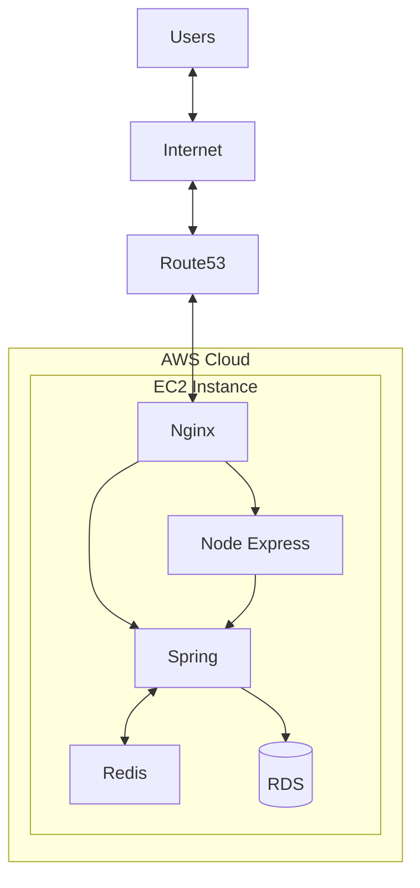
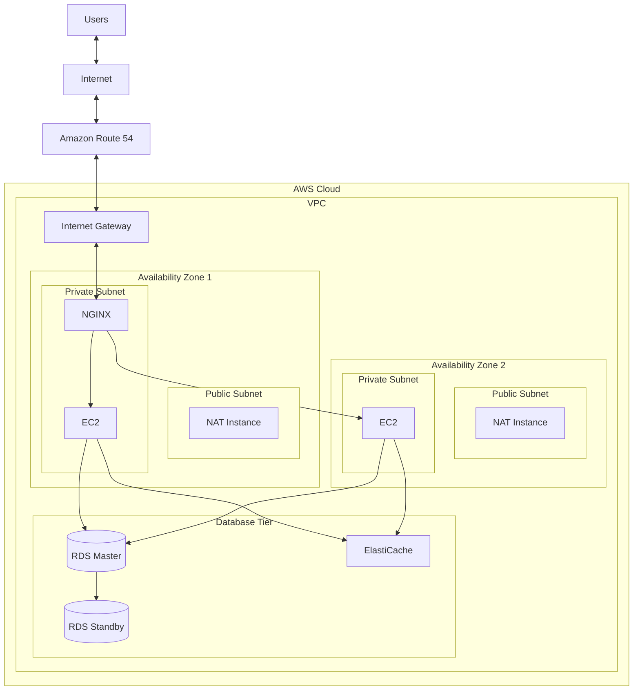

 

### </> 이유를 찾고 이유를 만들어가는 개발자 </>

 

## 🙋‍♂️ About me

"문제를 해결하는 데브워크 주니어, 저는 개발의 경계를 넓힙니다."

개발자는 단순한 기술자가 아니라 문제 해결사입니다. 저는 개발을 단순한 '스킬'이 아닌, 비즈니스, 서비스와 소통하며 퍼포먼스를 내는 '데브워크(DevWork)'라고 생각합니다. 개발, 구현력뿐만 아니라 회사를 이해하고, 효과적으로 소통하며, 올바른 방향을 선택하고 책임감을 가져야 한다고 생각합니다.

### 🔥 퍼포먼스를 내는 개발자 
개발 스킬뿐만 아니라 상대방이 원하는 것을 잘 이해하고 파악하여 정해진 시간, 정해진 퀄리티 안으로 구현해나가는 것, 필요하면 배워서라도 해가는, 단순히 할 수 있는 것과 되는 것이 아닌 할 수 있도록 만드는 개발자가 되고자 합니다.

### 🤝 우리의 힘
저는 개인의 역량보다 함께할 때 발휘되는 힘과 시너지가 비교할 수 없을 만큼 크다고 생각합니다.
프로젝트 경험에서 저는 항상 '나'보다는 '우리'를 우선시하며, '내가 어떻게 성장할까'보다는 '우리가 어떻게 하면 더 나은 결과와 최고의 결과를 만들어낼 수 있을까'를 끊임없이 고민하고 노력해왔습니다.

### 🧘 건강의 중요성을 깨달은 개발자
한때는 밤낮없이 개발하며 퍼포먼스를 내는 것만이 전부라고 생각했습니다.
하지만 건강을 잃고 나서야, 개발자는 꾸준히, 지속적으로 성장해야 하는 직업임을 깨달았습니다.
이를 위해서는 균형 잡힌 삶과 지속 가능한 개발이 필수적이라는 것을 몸소 체험하며 깊이 깨달았습니다.
그 후, 지속 가능한 성장을 위해 건강을 최우선으로 돌보며, 현재는 누구보다 건강을 중요시하는 개발자로 살아가고 있습니다.

 

## 📞 Contact & Channel
- **Phone**: 010-2651-9025
- **Email**: gustn9025@naver.com
- **Github**: [github.com/IMCODER0000](https://github.com/IMCODER0000)
- **Portfolio**: [Notion Portfolio](https://www.notion.so/Back-End-Developer-16ca23f0db9b80d2b63cc965e546aa2b)

 

## 🛠 Skills

### Languages

### Framework / Library

### Database

### Infrastructure

 

## 💻 Projects

### IntellyCosm (2024.03 ~ 2024.06, 리팩토링: 2025.02 ~ 현재)
화장품 성분 분석 및 AI 기반 개인화 추천 플랫폼

**주요 기술:**
- Spring Boot, JPA, Spring Security
- AWS, Docker
- MySQL, Redis
- React (Admin)

**주요 성과:**
- 쿼리 최적화로 DB 조회 시간 40% 단축
- 커넥션 풀 최적화로 동시 처리 성능 200% 향상
- 화장품 데이터 처리 성능 70.1% 개선 (278ms → 83ms)
- 캐싱 레이어 도입으로 응답 시간 40% 감소

### TTP(Time To Play) [개인 프로젝트] (2024.01 ~ 현재)
실시간 웹소켓 기반 멀티플레이어 게임 플랫폼

**주요 기술:**
- Spring Boot (WebSocket)
- React
- Node.js
- Redis

**주요 성과:**
- WebSocket 기반 실시간 게임 서비스 구현
- 평균 응답 지연시간 50ms 이하 달성
- 시스템 안정성 85% 향상
- CPU 사용률 29% 감소

### Festival (2023.11 ~ 2024.12, 리팩토링: 2025.02 ~ 현재)
축제 정보 제공 및 소셜 플랫폼

**주요 기술:**
- Node.js, Express
- Spring Boot (마이그레이션)
- React, Flutter
- AWS (S3, Lambda)

**주요 성과:**
- AWS 리소스 최적화로 CPU 사용률 40~50% 감소
- 메모리 사용률 30~35% 절감
- 복합 인덱스 활용으로 쿼리 실행 시간 40% 개선
- 동시접속자 처리량 200% 향상

### TTP(Time To Play) [개인 프로젝트] (2024.01 ~ 현재)
실시간 웹소켓 기반 멀티플레이어 게임 플랫폼

**주요 기술:**
- Spring Boot (WebSocket)
- React
- Node.js
- Redis

**주요 성과:**
- WebSocket 기반 실시간 게임 서비스 구현
- 평균 응답 지연시간 50ms 이하 달성
- 시스템 안정성 85% 향상
- CPU 사용률 29% 감소

&fontSize=70&animation=fadeIn&fontAlignY=35&desc=Play%20Together,%20Anytime,%20Anywhere&descAlignY=51&descAlign=50)

### 🎮 함께 즐기는 실시간 멀티플레이 게임 플랫폼

## 📖 프로젝트 소개

TTP(Time To Play)는 웹소켓 기반의 실시간 멀티플레이 게임 플랫폼입니다. PC, 모바일, 태블릿 등 다양한 디바이스에서 친구들과 함께 즐길 수 있는 게임 서비스를 제공합니다.

### 💝 프로젝트의 시작

이 프로젝트는 특별한 의미를 가지고 시작되었습니다. 3년간 병원에 입원 중인 한 어린 친구와의 만남이 계기가 되었습니다. "친구들과 함께 놀고 싶다"는 그 친구의 소망을 듣고, 거리와 상황에 상관없이 누구나 함께 즐길 수 있는 플랫폼을 만들기로 결심했습니다.

### 🎯 주요 기능

- **라이어 게임**: 거짓말쟁이를 찾아내는 추리 게임
- **스피드 퀴즈**: 친구들과 함께 즐기는 빠른 답변 게임
- **심리 테스트**: 재미있는 심리 테스트로 서로를 알아가기
- **실시간 채팅**: 게임 중 실시간 소통 가능

## 🛠 기술 스택

### Backend
- **Spring Boot**: 메인 게임 서버
- **Node.js & Express**: 보조 게임 서버
- **WebSocket & STOMP**: 실시간 양방향 통신
- **JPA**: 데이터 영속성 관리
- **Spring Security**: 보안 관리

### Frontend
- **React**: 웹 클라이언트
- **WebSocket**: 실시간 통신
- **Styled-components**: 스타일링

### Database & Cache
- **MySQL**: 주 데이터베이스
- **Redis**: 세션 및 실시간 데이터 관리
- **Caffeine**: 로컬 캐시

### Infrastructure
- **AWS EC2**: 서버 호스팅
- **AWS RDS**: 데이터베이스 관리
- **CloudFront**: CDN 서비스
- **Docker**: 컨테이너화
- **Nginx**: 웹 서버 및 로드 밸런싱

## 🏗 시스템 아키텍처

### 초기 아키텍처 (Current)
기본적인 기능 구현과 서비스 안정화에 초점을 맞춘 아키텍처입니다.

### 향후 아키텍처 (To-Be)
서비스 확장성과 가용성을 고려한 고도화된 아키텍처입니다.

### 주요 개선 사항
- **가용성 향상**: 다중 가용 영역(AZ) 구성으로 서비스 안정성 강화
- **보안 강화**: VPC 내 public/private 서브넷 분리로 보안 계층화
- **확장성 개선**: 
  - NAT Instance를 통한 효율적인 네트워크 트래픽 관리
  - RDS 마스터-스탠바이 구성으로 데이터베이스 가용성 확보
  - ElastiCache 도입으로 성능 최적화
- **운영 효율성**: 
  - 체계적인 네트워크 구성으로 관리 효율성 증대
  - 장애 발생 시 신속한 복구 가능

## 🚀 성능 최적화

### 비동기 처리
- AsyncConfig를 통한 커스텀 스레드 풀 구성
- @Async 어노테이션으로 비동기 처리 구현
- WebSocket을 통한 실시간 게임 상태 동기화

### 동시성 관리
- ConcurrentHashMap으로 게임 상태 관리
- ReentrantLock으로 동시성 제어
- 분산 락으로 다중 서버 환경 동기화

### 캐시 최적화
- Redis를 활용한 세션 관리
- Caffeine 캐시로 로컬 캐싱 구현
- 계층형 캐시 아키텍처 적용

## 📈 성능 지표

- 서버 응답 시간: 평균 50ms 이하
- 동시 접속자: 최대 3000명 수용
- 메모리 사용 효율: 2배 향상
- CPU 사용률: 29% 감소

## 🎯 개발 현황 및 계획

### 현재 진행 상황 (45% 구현)
- [x] 기본 게임 로직 구현
- [x] 실시간 통신 기반 마련
- [x] 기본 인프라 구축
- [x] 동시성 관리 시스템 구축

### 단기 목표 (2주)
- [ ] 핵심 게임 로직 비동기 전환
- [ ] 락 메커니즘 최적화
- [ ] 캐시 시스템 고도화

### 중기 목표 (1개월)
- [ ] WebFlux 도입
- [ ] 트랜잭션 관리 개선
- [ ] 모니터링 시스템 구축

## 🤝 기여 방법

1. 이 저장소를 포크합니다
2. 새로운 브랜치를 생성합니다
3. 변경사항을 커밋합니다
4. 브랜치에 푸시합니다
5. Pull Request를 생성합니다

## 📝 라이센스

이 프로젝트는 MIT 라이센스를 따릅니다. 자세한 내용은 [LICENSE](LICENSE) 파일을 참조하세요.

---

### 💌 연락처

 

## 🎓 Education

### 가천대학교 (2023.03 ~ 2025.02)
- 컴퓨터공학과 학사

